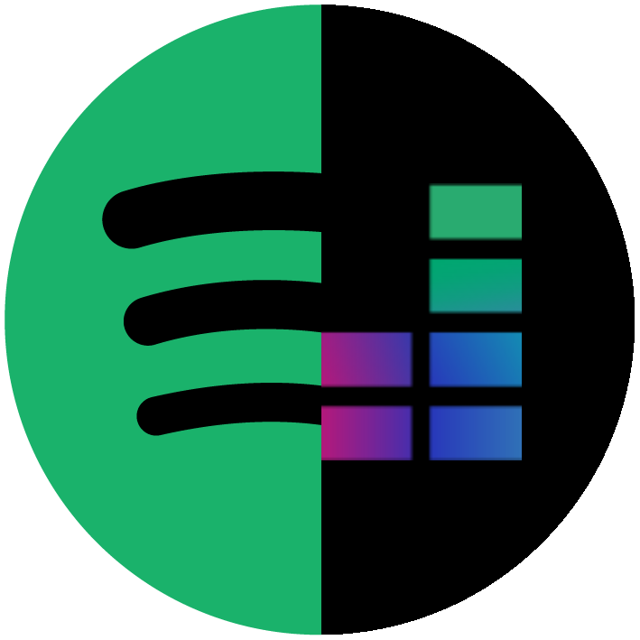

<p align="center">
  <a href="" rel="noopener">
 </a>
</p>

<h3 align="center">Spotify2Deezer</h3>
 
##   About 

Python scripts to convert and sync Spotify Playlist to Deezer Playlist using their respective APIs, and a discord bot implementing them. Deezer playlist is limited to <a href="https://support.deezer.com/hc/en-gb/articles/115004522449-Content-limits">2000 songs</a>, the bot does not convert or sync playlist over due to this. It is understood that the search method and sync method are in no way the best, and was only created for adequate functionality.

🔗[Invite Discord Bot](https://discord.com/api/oauth2/authorize?client_id=894362681027473428&permissions=277025451072&scope=bot)

## Built Using <a name = "built_using"></a>

-   Python
-   Python Request  
-   [Spotify API](https://developer.spotify.com/console/)
-   [Deezer API](https://developers.deezer.com/api)
-   [Pycord](https://docs.pycord.dev/en/master/) 
-   PostgreSQL
-   Heroku
 
## Try it yourself! 
To set up, download the files and then install the packages in requirement.txt.  
Afterwards, create a .env file in the directory for the CLI or Discord Bot, and complete the env with information for one of the two:

### CLI:
```markdown
APP_ID = "deezer_app_id"
SECRET = "deezer_secret_id"
REDIRECT_URL = "deezer_redirect_url"
SPOTIPY_CLIENT_ID = "spotify_client_id"
SPOTIPY_CLIENT_SECRET = "spotify_client_secret"
SPOTIPY_REDIRECT_URI = "spotify_redirect_url"
```

### Discord Bot:

```markdown
TOKEN = "discord_token"
KEY = "key_fernet"
DATABASE_URL= "postgres_url"
APP_ID = "deezer_app_id"
SECRET = "deezer_secret_id"
REDIRECT_URL = "deezer_redirect_url"
SPOTIPY_CLIENT_ID = "spotify_client_id"
SPOTIPY_CLIENT_SECRET = "spotify_client_secret"
SPOTIPY_REDIRECT_URI = "spotify_redirect_url"
```

<span>Get Deezer API Info by creating app on <a href="https://developers.deezer.com/api/oauth">Deezer for developers</a></span>
<br>
<span>Get Spotify API Info by creating app on <a href="https://developer.spotify.com/dashboard/applications">Spotify for developers</a></span>

Finally, run the main.py file.
